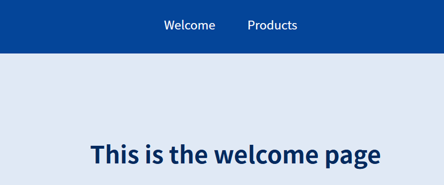
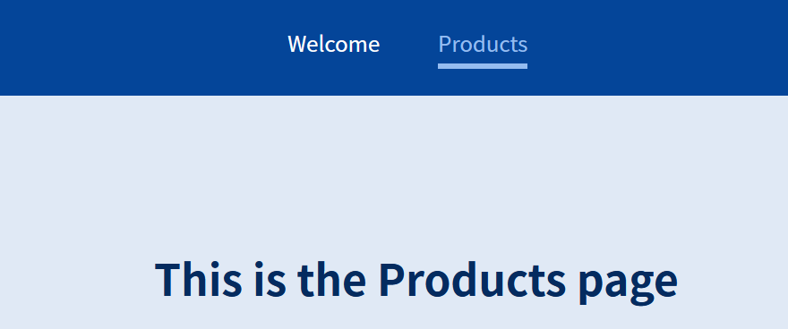

# REACT  Routing

---

In this repository, I'm practicing with ReactJs routing. 

@[Maximilian Schwarzmüller ](https://github.com/maxschwarzmueller)

One important feature of React is that it can render diferent elements into a single page. 
You can choose to hide elements, show other elements, you name it... You can use only one page, one path. 

But sometimes it's desirable to have different paths. Specially with a bigger website with many functionalities, things can get a little complicated. For instance, If you have a webpage to sell products, and you have a path for each product, 
you can send a link to somebody, and you know the link will take to a certain product. On the other hand, if everything loads onto one single page, if you send the link, it will load the main page, not the product.

---
## Working with Links

Working with links is a bit tricky though. If we use standard links <a...> we will reload the page, and we will lose any state that we had. For example, if the user has a cart with items loaded as a state, that will make the cart lose its content. 

### Link vs NavLink

Link         |  NavLink
:-------------------------:|:-------------------------:
  |  

Unlike Link, NavLink allows us to see what page we're actually on. That can be quite usefull sometimes.

What it does is: it has a prop that allows us to set a css class to the button whenever the page is active.

    <NavLink activeClassName="activePage" to="/welcome">Welcome</NavLink>

## Dynamic path

Let's say we need to access some products details. It's good to have a path to each product.

Now, creating a route to each product by hand is not ideal. It's better to have one path that can be changed according to the input.

There's a hook that allows parameters or props to be passed to the page via the path.

        <Route path="/product-detail/:productId">
          <ProductDetail/>
        </Route>

In the example above, I can type anything after the colon and it will be used as a parameter.

## Switch

<Switch> prevents multiple routes to render at once. But it will render the FIRST path that matches the user input. To prevent that, we have to use the EXACT prop.

           <Switch>
            <Route path="/welcome">
              <Welcome/>
            </Route>
            <Route path="/products" exact>
              <Products/>
            </Route>
            <Route path="/products/:productId">
              <ProductDetail/>
            </Route>
        </Switch>

If I don't add the 'EXACT' prop to 'path="/products"', 'path="/products/:productId"' will never render.
    
## Redirecting users
    
            <Route path="/" exact>
              <Redirect to="/welcome"/>
            </Route>
    
< Redirect > redirects the user to the welcome page.
